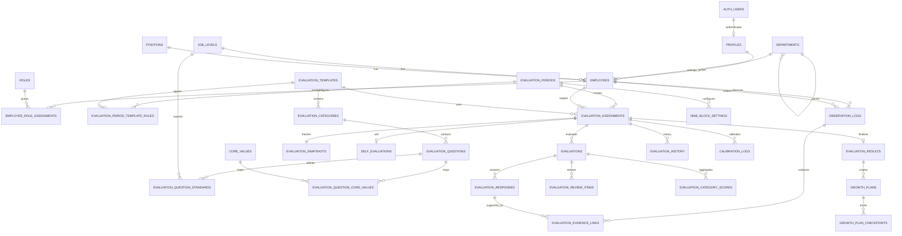

# AMCOMPANY 인사진단 DB ERD — STEP 2

## 핵심 설계 원칙

1. `auth.users`는 인증 원천이고 `profiles`는 앱 계정, `employees`는 인사정보다.
2. 평가 시작 시 `evaluation_snapshots`에 직원·조직·직급·직책·평가자·문항·행동기준·핵심가치를 JSON으로 동결한다.
3. 현재 Master Data가 변경되어도 과거 평가는 Snapshot 기준으로 재현한다.
4. 평가 작성/수정은 `evaluation_history`에 자동 기록한다.
5. 최종 확정값은 `evaluation_results`로 별도 Materialize하여 향후 계산식 변경과 분리한다.
6. 2차 평가 검토는 `evaluation_review_items`에 문항별로 기록한다.
7. 관찰근거는 `evaluation_evidence_links`로 평가응답과 직접 연결한다.
8. STEP 2에서 새로 생성된 테이블은 RLS를 활성화하되 허용 정책은 만들지 않는다. 세부 정책은 STEP 4에서 구현한다.
